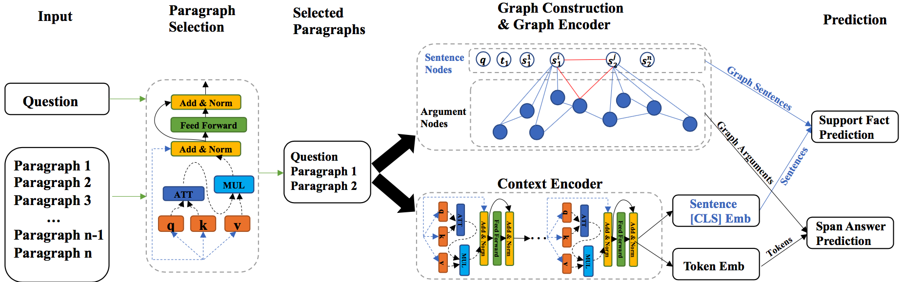

# The source code of SRLGRN

<p align="center"></p>

## running whole evaluation code:
1. Download the ckpt files (the link is shown in the ckpt folder);

2. Make sure the test_config is correct: 
```
./end_to_end_test/test_config.py
```

3. running the script:
```
sh run_pred.sh
```

>- Turing: Note that I use 4 GeForce RTX 2080 Ti for my emperiment, and the batch size is 32.
>- Three gpu need to take about 6,872MB of gpu memory, and One gpu take around 8,226MB。
>- Training bert-base-uncase

>- Avicenna: Note that I use 1 TITAN RTX for my emperiment, and the batch size is 8. take around 20,307MB。
>- Training bert-large-uncase

>- Supporting fact: If predict_batch_size == 4, then the gpu memory is 7669 MiB 
>- Answer span prediction: If predict_batch_size == 4, then the gpu memory is 3709 MiB 

## Notes

1. transfer data to squad format (data_preprocessing):
```
cd /home/zhengc12/codes/python_codes/rangers/data_preprocessing

python transfer_data_to_squad_format.py
```

2. run supporting fact code:
> train:
```
cd ./para_sp

python train.py
```

> test:
```
./para_sp

python predict.py
```

3. run reader code:
> train:
```
cd ./para_reader

python train.py
```

> test:
```
./para_reader

python test.py
```

## How to evaluate the result:

```
sh run_pred.sh
```


### reader code 

>- unique_id: 1000000036
>- example_index: 19
>- doc_span_index: 0
>- tokens: <s> amer ican Ġpolitician Ġjo e Ġheck Ġran Ġunsuccessfully Ġagainst Ġdemocrat Ġc atherine Ġcort ez Ġmast o , Ġa Ġwoman Ġwho Ġpreviously Ġserved Ġas Ġthe Ġ32 nd Ġattorney Ġgeneral Ġof Ġwhere ? </s> j ose ph john âĢ ľ j oe âĢ Ŀ he ck ( born oct ober 30 , 19 61 ) is an amer ican polit ician , phys ician , and u . s . arm y br ig adier general who had served as the u . s . represent ative for ne v ada 's 3 rd cong ress ional dist rict from 2011 to 2017 . he ck , a member of the rep ublic an party , is a board - cert ified phys ician and served as a ne v ada state sen ator from 2004 - 08 . he ran un successfully against dem ocrat c atherine c ort ez mast o in the general election for the open ne v ada united states sen ate seat in 2016 . in the same year , he ck made head lines by joining a long list of rep ublic ans who opp osed the g op nom ine e for president , donald trump . c atherine mar ie c ort ez mast o ( born m arch 29 , 1964 ) is an amer ican att orney and polit ician who is the jun ior united states sen ator from ne v ada . she is a member of the democratic party . she pre viously served as the 32 nd att orney general of ne v ada from 2007 to 2015 . k am ala dev i har ris ( , ; born oct ober 20 , 1964 ) is an amer ican att orney and polit ician . a member of the democratic party , she currently serv es as the jun ior sen ator from cal if ornia . she pre viously served as the 32 nd att orney general of cal if ornia . </s>
>- token_to_orig_map: 33:0 34:0 35:0 36:1 37:2 38:2 39:2 40:2 41:2 42:2 43:3 44:3 45:4 46:4 47:5 48:5 49:6 50:6 51:7 52:7 53:7 54:8 55:9 56:10 57:10 58:11 59:11 60:11 61:12 62:12 63:12 64:13 65:14 66:14 67:14 68:14 69:15 70:15 71:16 72:16 73:16 74:17 75:18 76:19 77:20 78:21 79:22 80:23 81:23 82:23 83:23 84:24 85:24 86:25 87:26 88:26 89:26 90:26 91:27 92:27 93:28 94:28 95:28 96:29 97:29 98:30 99:31 100:32 101:33 102:33 103:34 104:34 105:34 106:35 107:36 108:37 109:38 110:39 111:39 112:39 113:40 114:40 115:41 116:42 117:43 118:43 119:43 120:43 121:44 122:44 123:45 124:46 125:47 126:48 127:49 128:49 129:49 130:50 131:51 132:51 133:52 134:53 135:53 136:53 137:53 138:54 139:55 140:56 141:56 142:57 143:58 144:58 145:59 146:59 147:60 148:60 149:60 150:61 151:61 152:62 153:63 154:64 155:65 156:66 157:67 158:68 159:69 160:69 161:69 162:70 163:71 164:72 165:72 166:73 167:74 168:75 169:75 170:76 171:77 172:78 173:79 174:79 175:80 176:80 177:81 178:82 179:82 180:83 181:84 182:85 183:86 184:87 185:88 186:89 187:89 188:89 189:90 190:91 191:91 192:92 193:93 194:93 195:94 196:94 197:94 198:95 199:96 200:96 201:97 202:98 203:98 204:98 205:98 206:99 207:99 208:100 209:100 210:100 211:101 212:101 213:102 214:102 215:103 216:103 217:104 218:104 219:105 220:105 221:106 222:107 223:108 224:108 225:109 226:109 227:110 228:111 229:111 230:112 231:113 232:114 233:115 234:115 235:116 236:117 237:118 238:118 239:119 240:120 241:120 242:120 243:120 244:121 245:122 246:123 247:124 248:125 249:126 250:127 251:128 252:128 253:129 254:130 255:130 256:131 257:132 258:133 259:134 260:134 261:135 262:135 263:136 264:137 265:138 266:138 267:138 268:139 269:140 270:141 271:142 272:142 273:142 274:142 275:142 276:143 277:143 278:144 279:144 280:145 281:146 282:147 283:148 284:149 285:149 286:150 287:150 288:151 289:151 290:152 291:153 292:154 293:154 294:155 295:155 296:156 297:157 298:157 299:157 300:158 301:159 302:160 303:161 304:162 305:163 306:163 307:164 308:165 309:166 310:166 311:167 312:168 313:169 314:169 315:170 316:170 317:171 318:172 319:172 320:172 321:172 322:173 323:174 324:174 325:175 326:176 327:177 328:178 329:178 330:179 331:179 332:180 333:181 334:182 335:182 336:182 337:182
04/27/2020 13:28:35 - INFO - rc_utils -   token_is_max_context: 33:True 34:True 35:True 36:True 37:True 38:True 39:True 40:True 41:True 42:True 43:True 44:True 45:True 46:True 47:True 48:True 49:True 50:True 51:True 52:True 53:True 54:True 55:True 56:True 57:True 58:True 59:True 60:True 61:True 62:True 63:True 64:True 65:True 66:True 67:True 68:True 69:True 70:True 71:True 72:True 73:True 74:True 75:True 76:True 77:True 78:True 79:True 80:True 81:True 82:True 83:True 84:True 85:True 86:True 87:True 88:True 89:True 90:True 91:True 92:True 93:True 94:True 95:True 96:True 97:True 98:True 99:True 100:True 101:True 102:True 103:True 104:True 105:True 106:True 107:True 108:True 109:True 110:True 111:True 112:True 113:True 114:True 115:True 116:True 117:True 118:True 119:True 120:True 121:True 122:True 123:True 124:True 125:True 126:True 127:True 128:True 129:True 130:True 131:True 132:True 133:True 134:True 135:True 136:True 137:True 138:True 139:True 140:True 141:True 142:True 143:True 144:True 145:True 146:True 147:True 148:True 149:True 150:True 151:True 152:True 153:True 154:True 155:True 156:True 157:True 158:True 159:True 160:True 161:True 162:True 163:True 164:True 165:True 166:True 167:True 168:True 169:True 170:True 171:True 172:True 173:True 174:True 175:True 176:True 177:True 178:True 179:True 180:True 181:True 182:True 183:True 184:True 185:True 186:True 187:True 188:True 189:True 190:True 191:True 192:True 193:True 194:True 195:True 196:True 197:True 198:True 199:True 200:True 201:True 202:True 203:True 204:True 205:True 206:True 207:True 208:True 209:True 210:True 211:True 212:True 213:True 214:True 215:True 216:True 217:True 218:True 219:True 220:True 221:True 222:True 223:True 224:True 225:True 226:True 227:True 228:True 229:True 230:True 231:True 232:True 233:True 234:True 235:True 236:True 237:True 238:True 239:True 240:True 241:True 242:True 243:True 244:True 245:True 246:True 247:True 248:True 249:True 250:True 251:True 252:True 253:True 254:True 255:True 256:True 257:True 258:True 259:True 260:True 261:True 262:True 263:True 264:True 265:True 266:True 267:True 268:True 269:True 270:True 271:True 272:True 273:True 274:True 275:True 276:True 277:True 278:True 279:True 280:True 281:True 282:True 283:True 284:True 285:True 286:True 287:True 288:True 289:True 290:True 291:True 292:True 293:True 294:True 295:True 296:True 297:True 298:True 299:True 300:True 301:True 302:True 303:True 304:True 305:True 306:True 307:True 308:True 309:True 310:True 311:True 312:True 313:True 314:True 315:True 316:True 317:True 318:True 319:True 320:True 321:True 322:True 323:True 324:True 325:True 326:True 327:True 328:True 329:True 330:True 331:True 332:True 333:True 334:True 335:True 336:True 337:True
04/27/2020 13:28:35 - INFO - rc_utils -   input_ids: 0 8015 12657 8676 13509 242 17835 2075 24085 136 26232 740 38687 30249 5841 29602 139 6 10 693 54 1433 1665 25 5 2107 1187 1921 937 9 147 116 2 267 3876 3792 25304 17 48 267 3540 17 46 700 2420 1640 5400 32643 24761 541 6 1646 5606 43 354 260 8015 12657 25214 14932 6 39409 14932 6 463 257 4 29 4 4526 219 3809 1023 28071 15841 8155 12186 33091 281 627 257 4 29 4 35213 3693 1990 858 705 2095 18 246 2586 37519 5224 6073 17165 12127 7761 22748 560 3789 4 700 2420 6 102 8648 1116 627 12597 40171 260 6493 6 354 102 4929 12 25782 3786 39409 14932 463 33091 281 102 858 705 2095 4897 7305 2630 7761 34972 12 3669 4 700 3917 879 46958 22268 12789 22730 438 38687 438 2723 5841 40668 139 179 627 15841 6414 1990 627 12592 858 705 2095 33557 26947 7305 877 11517 179 9029 4 179 627 41690 180 6 700 2420 7078 3628 11723 1409 45683 102 3479 8458 1116 12597 40171 1253 8155 10223 7878 627 571 1517 13681 833 242 1990 10443 6 24139 38060 4 438 38687 3916 324 438 2723 5841 40668 139 1640 5400 119 13161 2890 6 45629 43 354 260 8015 12657 2611 42276 463 25214 14932 8155 354 627 18115 7375 33557 26947 7305 2630 7761 858 705 2095 4 8877 354 102 8648 1116 627 38566 6493 4 8877 5234 34978 33091 281 627 2881 1187 2611 42276 15841 1116 858 705 2095 7761 30741 560 14420 4 330 424 2331 20068 118 4759 4663 1640 6 131 5400 32643 24761 844 6 45629 43 354 260 8015 12657 2611 42276 463 25214 14932 4 102 8648 1116 627 38566 6493 6 8877 38501 31499 293 281 627 18115 7375 7305 2630 7761 11762 1594 43052 4 8877 5234 34978 33091 281 627 2881 1187 2611 42276 15841 1116 11762 1594 43052 4 2 1 1 1 1 1 1 1 1 1 1 1 1 1 1 1 1 1 1 1 1 1 1 1 1 1 1 1 1 1 1 1 1 1 1 1 1 1 1 1 1 1 1 1 1 1
04/27/2020 13:28:35 - INFO - rc_utils -   input_mask: 1 1 1 1 1 1 1 1 1 1 1 1 1 1 1 1 1 1 1 1 1 1 1 1 1 1 1 1 1 1 1 1 1 1 1 1 1 1 1 1 1 1 1 1 1 1 1 1 1 1 1 1 1 1 1 1 1 1 1 1 1 1 1 1 1 1 1 1 1 1 1 1 1 1 1 1 1 1 1 1 1 1 1 1 1 1 1 1 1 1 1 1 1 1 1 1 1 1 1 1 1 1 1 1 1 1 1 1 1 1 1 1 1 1 1 1 1 1 1 1 1 1 1 1 1 1 1 1 1 1 1 1 1 1 1 1 1 1 1 1 1 1 1 1 1 1 1 1 1 1 1 1 1 1 1 1 1 1 1 1 1 1 1 1 1 1 1 1 1 1 1 1 1 1 1 1 1 1 1 1 1 1 1 1 1 1 1 1 1 1 1 1 1 1 1 1 1 1 1 1 1 1 1 1 1 1 1 1 1 1 1 1 1 1 1 1 1 1 1 1 1 1 1 1 1 1 1 1 1 1 1 1 1 1 1 1 1 1 1 1 1 1 1 1 1 1 1 1 1 1 1 1 1 1 1 1 1 1 1 1 1 1 1 1 1 1 1 1 1 1 1 1 1 1 1 1 1 1 1 1 1 1 1 1 1 1 1 1 1 1 1 1 1 1 1 1 1 1 1 1 1 1 1 1 1 1 1 1 1 1 1 1 1 1 1 1 1 1 1 1 1 1 1 1 1 1 1 1 1 1 1 1 1 1 1 1 1 1 1 0 0 0 0 0 0 0 0 0 0 0 0 0 0 0 0 0 0 0 0 0 0 0 0 0 0 0 0 0 0 0 0 0 0 0 0 0 0 0 0 0 0 0 0 0
04/27/2020 13:28:35 - INFO - rc_utils -   segment_ids: 0 0 0 0 0 0 0 0 0 0 0 0 0 0 0 0 0 0 0 0 0 0 0 0 0 0 0 0 0 0 0 0 0 1 1 1 1 1 1 1 1 1 1 1 1 1 1 1 1 1 1 1 1 1 1 1 1 1 1 1 1 1 1 1 1 1 1 1 1 1 1 1 1 1 1 1 1 1 1 1 1 1 1 1 1 1 1 1 1 1 1 1 1 1 1 1 1 1 1 1 1 1 1 1 1 1 1 1 1 1 1 1 1 1 1 1 1 1 1 1 1 1 1 1 1 1 1 1 1 1 1 1 1 1 1 1 1 1 1 1 1 1 1 1 1 1 1 1 1 1 1 1 1 1 1 1 1 1 1 1 1 1 1 1 1 1 1 1 1 1 1 1 1 1 1 1 1 1 1 1 1 1 1 1 1 1 1 1 1 1 1 1 1 1 1 1 1 1 1 1 1 1 1 1 1 1 1 1 1 1 1 1 1 1 1 1 1 1 1 1 1 1 1 1 1 1 1 1 1 1 1 1 1 1 1 1 1 1 1 1 1 1 1 1 1 1 1 1 1 1 1 1 1 1 1 1 1 1 1 1 1 1 1 1 1 1 1 1 1 1 1 1 1 1 1 1 1 1 1 1 1 1 1 1 1 1 1 1 1 1 1 1 1 1 1 1 1 1 1 1 1 1 1 1 1 1 1 1 1 1 1 1 1 1 1 1 1 1 1 1 1 1 1 1 1 1 1 1 1 1 1 1 1 1 1 1 1 1 1 0 0 0 0 0 0 0 0 0 0 0 0 0 0 0 0 0 0 0 0 0 0 0 0 0 0 0 0 0 0 0 0 0 0 0 0 0 0 0 0 0 0 0 0 0

04/27/2020 13:28:35 - INFO - rc_utils -   start_position: 87

04/27/2020 13:28:35 - INFO - rc_utils -   end_position: 89

04/27/2020 13:28:35 - INFO - rc_utils -   answer: ne v ada

04/27/2020 13:42:21 - INFO - __main__ -     Saving train features into cached file /home/hlr/shared/data/chenzheng/data/hotpotqa/rangers/data/hotpot_train_squad.json_roberta-large_384_128_64

04/27/2020 13:42:37 - INFO - __main__ -   ***** Running training *****

04/27/2020 13:42:37 - INFO - __main__ -     Num orig examples = 90387

04/27/2020 13:42:37 - INFO - __main__ -     Num split examples = 179081

04/27/2020 13:42:37 - INFO - __main__ -     Batch size = 8

04/27/2020 13:42:37 - INFO - __main__ -     Num steps = 33894

